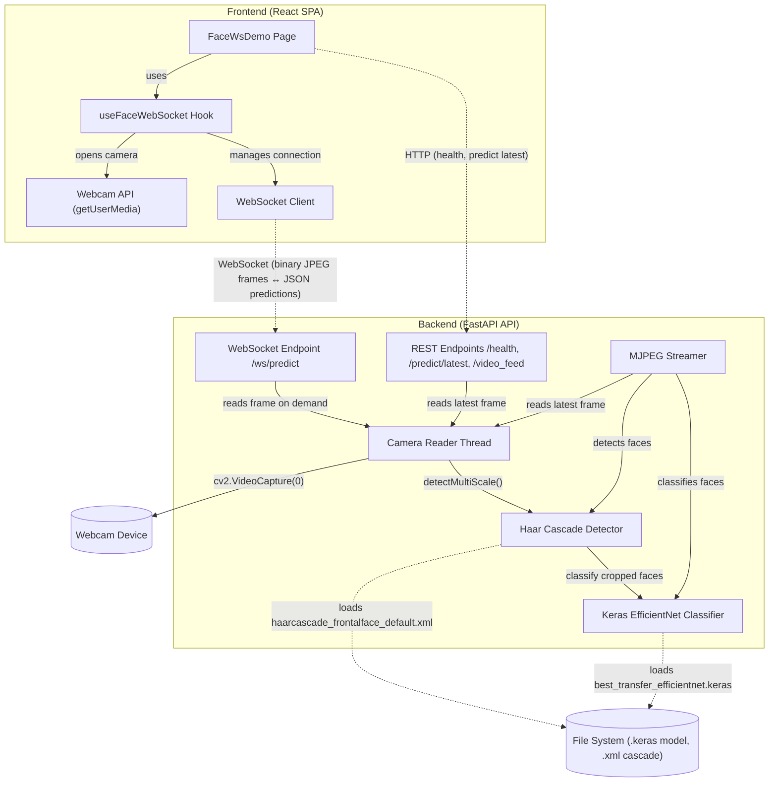

# Documentación del aplicativo de reconocimiento facial

## Resumen general

Este documento presenta la arquitectura, el despliegue, la infraestructura, la escalabilidad, los costos estimados y las consideraciones de mantenimiento necesarias para operar el aplicativo de reconocimiento facial basado en FastAPI, OpenCV, Keras y una interfaz web React. La solución fue validada con una arquitectura unificada, donde el frontend compilado se sirve desde la misma aplicación backend y el modelo entrenado se consume desde un servicio de inferencia expuesto por HTTP y WebSocket. Este enfoque reduce la complejidad operativa y facilita la puesta en marcha del aplicativo en un entorno reproducible mediante Docker Compose.

Para el alcance actual del proyecto, la aplicación se entiende como una solución académica y de validación funcional. Por esta razón, el despliegue se plantea inicialmente en una arquitectura simple basada en Docker y FastAPI. Sin embargo, también se documentan escenarios de crecimiento en AWS para estimar cómo podría evolucionar la infraestructura si la aplicación pasara de una prueba interna a un despliegue con mayor cantidad de usuarios.

## Contexto del aplicativo

El aplicativo permite capturar video desde la cámara del navegador, enviar frames al backend y devolver resultados de inferencia en tiempo real. La solución fue diseñada para mantenerse simple en su despliegue, pero suficientemente completa para documentar componentes, flujo operativo, infraestructura, costos proyectados y mantenimiento.

Actualmente, el objetivo principal no es operar una solución productiva a gran escala, sino demostrar el funcionamiento integrado del modelo, la interfaz y el backend. Por lo tanto, las estimaciones de costos incluidas en este documento deben interpretarse como una proyección de referencia para una posible implementación futura, no como una cotización final ni como evidencia de que la infraestructura ya fue desplegada en AWS.

## Arquitectura del aplicativo

La arquitectura del sistema se organiza en tres bloques: experiencia de usuario, servicios de aplicación y recursos operativos. Esta forma de estructurar la solución permite describir el sistema desde su funcionamiento real y desde sus dependencias de despliegue.

### Frontend

La interfaz está construida como una SPA React y se encarga de solicitar acceso a la cámara, capturar frames y conectar con el backend. En el navegador, el aplicativo usa `getUserMedia()` y un hook dedicado para mantener la sesión WebSocket activa.

### Backend

El backend concentra la lógica de inferencia en FastAPI, incluyendo el endpoint de salud, el endpoint de predicción por frame y el canal WebSocket en `/ws/predict`. El modelo se carga durante el ciclo de vida de la aplicación y se conserva en memoria para evitar recargas por cada solicitud.

### Recursos externos

El sistema depende de dos recursos externos clave: el dispositivo de cámara y los archivos de modelo y cascada almacenados en el sistema de archivos. Esto implica que la infraestructura debe garantizar acceso estable a la webcam y a las rutas internas del contenedor donde residen los artefactos de inferencia.

## Flujo operativo del aplicativo

1. El usuario abre la página principal en el navegador.
2. La interfaz solicita acceso a la cámara del dispositivo.
3. El frontend transmite frames al backend por WebSocket o consulta información por HTTP.
4. El backend detecta rostros y aplica el clasificador basado en Keras.
5. El resultado se devuelve en formato estructurado al frontend.
6. El usuario observa la salida del modelo dentro de la interfaz.

## Infraestructura requerida para el aplicativo

| Componente        | Requisito recomendado                         |
| ----------------- | --------------------------------------------- |
| Sistema operativo | Windows con Docker Desktop o Linux con Docker |
| CPU               | 4 núcleos o más                               |
| RAM               | 8 GB mínimo, 16 GB recomendado                |
| Almacenamiento    | 10 GB o más                                   |
| Webcam            | Integrada o externa                           |
| Navegador         | Chrome, Edge o Firefox actualizado            |
| Red local         | Puerto 8000 disponible                        |

## Escenarios de despliegue e infraestructura en AWS

Aunque el proyecto fue validado con una arquitectura local y contenerizada, para una posible operación en la nube se plantean escenarios progresivos de despliegue en AWS. La intención es mostrar cómo podría escalar la solución desde una demo académica hasta un ambiente productivo, manteniendo como punto de partida la forma real en que se desarrolló el aplicativo: frontend compilado servido por FastAPI, backend en el mismo servicio y despliegue mediante Docker.

| Etapa               | Alcance                                 | Arquitectura sugerida                                                              | Justificación                                                                  |
| ------------------- | --------------------------------------- | ---------------------------------------------------------------------------------- | ------------------------------------------------------------------------------ |
| Prueba interna      | Validación académica y demo             | Una sola instancia EC2 o contenedor Docker local                                   | Bajo costo, simple de desplegar y suficiente para pruebas controladas.         |
| MVP público pequeño | Hasta 1.000 usuarios registrados        | EC2 con Docker, FastAPI sirviendo frontend y backend en el mismo contenedor        | Mantiene la arquitectura validada y permite exponer una demo pública básica.   |
| Producción pequeña  | Cerca de 10.000 usuarios registrados    | ECS/Fargate con 2 a 4 tareas, Application Load Balancer, CloudWatch y ECR          | Mejora disponibilidad, monitoreo y capacidad de escalar réplicas del servicio. |
| Producción media    | Cerca de 100.000 usuarios registrados   | ECS/Fargate autoscaling, ALB, CloudFront, monitoreo y varias réplicas              | Permite manejar mayor concurrencia, distribuir tráfico y reducir latencia.     |
| Producción alta     | Cerca de 1.000.000 usuarios registrados | Arquitectura multi-AZ, autoscaling agresivo, CDN, optimización de inferencia o GPU | Requerida para alto tráfico, mayor disponibilidad y procesamiento intensivo.   |

Para el alcance actual del trabajo, el escenario más coherente es la prueba interna o el MVP público pequeño. Los escenarios superiores se incluyen como referencia de escalabilidad y como respuesta a los criterios de documentación de infraestructura, costos y mantenimiento.

## Supuestos para la estimación de costos

Las cifras presentadas son aproximadas y se construyen como una proyección de referencia. Los valores reales pueden variar según la región de AWS, el volumen de tráfico, el número de usuarios concurrentes, el tamaño de las imágenes procesadas, la frecuencia con la que se envían frames al backend y si el procesamiento se realiza en CPU, GPU o directamente en el navegador.

Para la estimación se considera una región de bajo costo como US East / N. Virginia, uso de Linux, ejecución continua 24/7 durante aproximadamente 730 horas al mes y una aplicación basada en contenedores.

Los principales componentes de costo considerados son:

- Instancia EC2 o tareas ECS/Fargate para ejecutar la aplicación.
- Almacenamiento de la imagen Docker en Amazon ECR.
- Logs y métricas en Amazon CloudWatch.
- Balanceador de carga en escenarios productivos.
- Transferencia de datos hacia Internet.
- Almacenamiento estático del frontend o archivos complementarios, si aplica.

## Estimación de costos mensuales en AWS

| Escenario             |               Usuarios estimados | Infraestructura sugerida                                                           |  Costo mensual aproximado |
| --------------------- | -------------------------------: | ---------------------------------------------------------------------------------- | ------------------------: |
| Demo / prueba interna |                 10 a 50 usuarios | 1 instancia EC2 pequeña, Docker, sin balanceador                                   |         USD 20 a 40 / mes |
| MVP académico público | Hasta 1.000 usuarios registrados | EC2 t3.medium o t3.large, Docker, logs básicos                                     |        USD 50 a 100 / mes |
| Producción pequeña    |      10.000 usuarios registrados | ECS/Fargate con 2 a 4 tareas, ALB, CloudWatch, ECR                                 |       USD 120 a 300 / mes |
| Producción media      |     100.000 usuarios registrados | ECS/Fargate autoscaling, ALB, CloudFront, monitoreo, varias réplicas               |     USD 600 a 2.000 / mes |
| Producción alta       |   1.000.000 usuarios registrados | Arquitectura multi-AZ, autoscaling agresivo, CDN, optimización de inferencia o GPU | USD 5.000 a 20.000+ / mes |

Estos valores no deben interpretarse como una cotización final, sino como una estimación inicial para dimensionar la infraestructura. En una etapa académica, el escenario más realista es el de demo o MVP pequeño, ya que el objetivo principal es validar el funcionamiento del modelo y la integración de la aplicación, no soportar tráfico masivo.

## Consideraciones de escalabilidad

El principal factor de costo y escalabilidad no es únicamente la cantidad de usuarios registrados, sino la cantidad de usuarios concurrentes y la frecuencia con la que la aplicación procesa imágenes o frames de video. Una aplicación de filtros faciales puede volverse costosa si cada usuario envía muchos frames por segundo al backend, especialmente si el procesamiento se realiza completamente del lado del servidor.

Por esta razón, para escalar de forma eficiente se recomienda:

1. Reducir la cantidad de frames enviados al backend.
2. Redimensionar las imágenes antes de enviarlas.
3. Procesar localmente en el navegador cuando sea posible.
4. Enviar al backend solo la información necesaria.
5. Usar autoscaling para aumentar o reducir contenedores según la demanda.
6. Definir límites de uso por sesión para evitar consumo excesivo.
7. Monitorear CPU, memoria, latencia, errores y tráfico saliente.

Para escenarios de alta concurrencia, sería recomendable evaluar librerías de visión por computador que puedan ejecutarse en el cliente, como modelos optimizados en navegador, o mover la inferencia a servicios especializados. Esto reduciría la carga del backend y permitiría que el servidor se encargue principalmente de la coordinación, autenticación, almacenamiento y entrega de resultados.

## Mantenimiento y evolución

La solución puede evolucionar hacia una arquitectura más desacoplada si en el futuro se requiere mayor concurrencia o una operación más robusta. Sin embargo, para el alcance actual, el aplicativo presenta una estructura clara, funcional y reproducible, adecuada para documentación técnica y despliegue controlado.

Además del costo de infraestructura, un despliegue productivo requiere considerar costos de mantenimiento técnico. Estos incluyen revisión de logs, actualización de dependencias, monitoreo de errores, gestión de seguridad, renovación de certificados, pruebas de compatibilidad, optimización de rendimiento y ajustes al modelo o a la API.

Para una aplicación académica o MVP, el mantenimiento puede ser realizado por el equipo de desarrollo con una dedicación parcial. Para producción, se recomienda asignar responsables para las siguientes actividades:

| Actividad                          | Frecuencia sugerida           |
| ---------------------------------- | ----------------------------- |
| Revisión de logs y errores         | Semanal                       |
| Validación de costos AWS           | Semanal o mensual             |
| Actualización de dependencias      | Mensual                       |
| Pruebas de seguridad básicas       | Mensual                       |
| Revisión de rendimiento del modelo | Mensual                       |
| Ajustes de escalabilidad           | Según crecimiento de usuarios |

## Riesgos de costos y mitigaciones

| Riesgo                              | Impacto                           | Mitigación recomendada                                                    |
| ----------------------------------- | --------------------------------- | ------------------------------------------------------------------------- |
| Envío excesivo de frames al backend | Aumento de CPU, memoria y tráfico | Limitar FPS, comprimir imágenes y procesar en cliente cuando sea posible. |
| Logs demasiado detallados           | Sobrecostos en CloudWatch         | Definir niveles de logging y políticas de retención.                      |
| Instancias encendidas sin uso       | Costos innecesarios               | Apagar ambientes de prueba cuando no se usen.                             |
| Falta de monitoreo                  | Dificultad para detectar fallas   | Configurar métricas básicas de CPU, memoria, latencia y errores.          |
| Escalamiento sin límites            | Sobrecostos por picos de tráfico  | Definir límites máximos de réplicas y alertas de presupuesto.             |

## Recomendación final de despliegue

Para el alcance actual del proyecto, se recomienda mantener una arquitectura simple basada en Docker y FastAPI, donde el backend pueda servir el frontend compilado y exponer los endpoints necesarios para la demo. Esta opción es coherente con una etapa académica de validación, reduce la complejidad del despliegue y permite demostrar el funcionamiento del modelo sin incurrir en costos altos.

Para una etapa posterior de producción, se recomienda migrar gradualmente a una arquitectura con backend contenerizado, balanceador de carga, monitoreo y escalamiento automático. En caso de que el frontend crezca o requiera mayor independencia, también podría separarse como contenido estático en S3/CloudFront. Esta evolución permitiría soportar más usuarios, mejorar la disponibilidad del sistema y controlar los costos de operación a medida que aumente la demanda.
